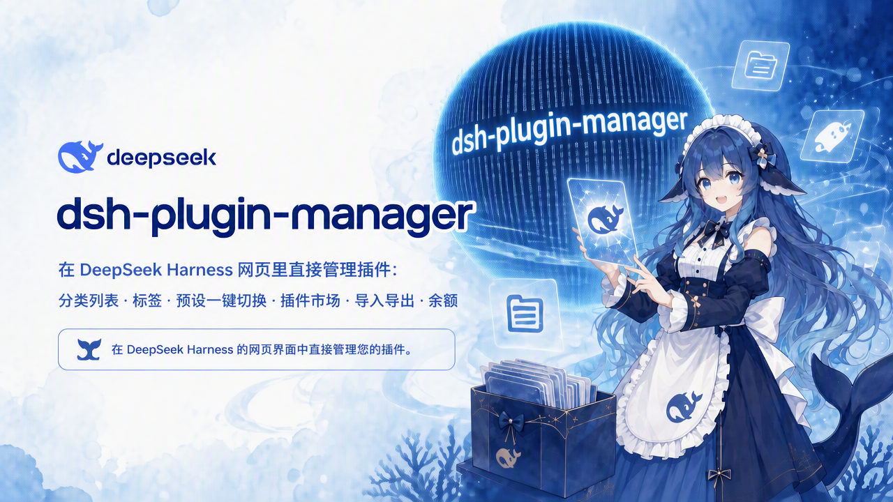

<div align="center">



# 🎛️ dsh-plugin-manager

**在 DeepSeek Harness 网页里直接管理插件:分类列表 · 标签 · 预设一键切换 · 插件市场 · 导入导出 · 余额**

Manage your DeepSeek Harness plugins right inside the web UI.

[](https://github.com/kkkkkklze/dsh-plugin-manager)
[](./LICENSE)
[](https://github.com/topics/dsh-plugin)

</div>

---

## ✨ 功能 / Features

- 📂 **分类列表** — 内置 128 个插件预分类(23 个标签族)+ 中文简介,搜索 / 筛选 / 启停 / 标签编辑;
- 📦 **插件包(预设)** — 点选插件组成整合包,一键切换 + 回滚,支持**导入 / 导出**(名字与介绍随包继承,方便分享);
- 🛒 **插件市场** — 浏览 GitHub `dsh-plugin` 主题仓库,自动识别真插件,一键安装;非插件给出可复制的安装提示词;
- 🛡️ **权限与安全** — 变更操作走审批(agent 工具)与确认弹窗(Web);市场安装参数**白名单校验**(owner/repo 格式,防命令注入);一键停止后可优雅退化为 dsh 原版插件列表;
- 💰 **余额与快捷入口** — 侧边栏显示 DeepSeek 余额(点击跳用量页)+ Chat 按钮;
- 🤖 **agent 工具** — `plugin_list / plugin_enable / plugin_disable / plugin_add / plugin_remove / plugin_tag / plugin_preset_list / plugin_preset_switch / plugin_rollback / plugin_stop_self / plugin_market_inspect / plugin_market_install`。

## 🔧 安装 / Install

```bash
# 从 GitHub 安装(推荐)
dsh plugin --profile <name> add github:kkkkkklze/dsh-plugin-manager
```

重启 dsh web 后:设置 → 插件 → 出现「分类 / 插件包 / 市场」三个子标签。

## 🚀 使用 / Usage

- 「分类」:查看 / 筛选 / 启停全部插件,带标签与简介;
- 「插件包」:点选插件组成整合包,一键切换、导入导出;
- 「市场」:默认「只看插件」扫描模式,点安装即可;
- 对话里:对 agent 说「切到日常预设」「用 plugin_list 看看」等。

## 🌱 愿景:统一插件依赖标准(Vision)

> 现在的 dsh 生态里有大量不同格式的**风格包 / 美化包**,互相冲突、装了 A 就坏 B。
> 我们想借鉴 **Minecraft 模组的「前置依赖(required dependency)」** 思路来统一它们。

设想:

1. 统一一个**前置 / 基础插件**作为公共底座,风格包 / 美化包声明对它依赖;
2. **依赖同一前置的插件互相兼容** —— 前置统一注册与渲染入口,风格包只负责提供内容;
3. 像 MCMod 的前置列表一样,装风格包时自动识别并提示它需要的前置;
4. 本插件后续支持**依赖追踪**:展示依赖关系、安装前校验前置是否齐备;
5. 可能需要插件按一定方式声明依赖(例如 `package.json` 的 `dsh` 清单增加 `requires` / `provides` 字段)。

如果你也受风格包冲突之苦、认同这个方向,欢迎来 Issue 讨论,一起定标准。

## 🧠 架构与原理 / Architecture

### 分层结构

```
Web 页面(client-bundle.js,浏览器)
   │  ctx.remote.$mount(CONTRIBUTION) → ctx.get('remote.pluginManager')
   ▼  Typert 远程协议(/api,严格编解码,零额外端口)
remote.js(网关,@deepseek-ai/dsh-typert-protocol)
   ▼
manager.js(核心操作,agent 工具与 Web 共用同一份逻辑)
   ▼  engine.js(patch DSL 解析/合成)
文件系统:profile/cordis.patch.yml · ~/.dsh/plugin-manager/state.json · ~/.dsh/plugin-presets.yml
```

### 插件管理原理

- **patch DSL**:dsh 的插件树由 `cordis.patch.yml` 描述(`insert` 新增行 / `id` 目标覆盖行 / `disabled` 停用)。本插件把自己管理的行统一持有:状态存 `state.json`(`inserted` + `overrides`),每次变更经 `sync()` 重新合成 patch —— 先过滤掉**我方行**(`pm-manager` / `pm.` 前缀 / 我方 insert 块),再叠加新状态,写入前自动备份到 `backups/`(可回滚)。
- **id 前缀**:loader 条目 id 常带子树前缀(`include:`),管理器自动探测自身行的前缀并剥离,读写一律用裸 id。
- **内置「插件」区接管**:启动时自动把 `ui-settings-plugin-inventory` 置为停用,并注入「分类 / 插件包 / 市场」三个子标签;自停(`stopSelf`)时恢复原版界面。
- **标签体系**:自动规则(`AUTO_TAG_RULES` 正则)∪ 出厂库(`default-tags.yml`)∪ 包声明(`package.json` 的 `dsh.bundle.tags`)∪ 用户标签(`tags.yml`),按优先级合并。

### 插件市场原理

- **数据源① Topic 搜索**:调用 GitHub Search API `q=topic:dsh-plugin&sort=stars&order=desc&per_page=30`(分页)。未认证限 10 次/分,故结果缓存进 `sessionStorage`(10 分钟)。
- **数据源② Awesome 精选**:直接抓取 `awesome-dsh-plugin/awesome-dsh-plugin` 的 README,正则解析条目(支持 `#fragment` 与 `/tree/<branch>/<dir>` 子目录写法,如 `zoahdev/dsh-subscribe#plugin`),分页浏览 —— 覆盖「没有 dsh-plugin topic」和「package.json 在子目录」的漏网插件。
- **插件识别**(`identify`):抓取仓库 `package.json`,判定 `isPlugin = 存在 dsh.bundle || dsh.client`。候选路径依次为 `默认分支(+子目录) → HEAD`(HEAD 为万能回退,实测对 748 个精选仓库全部有效)。并发限制 6(`mapLimit`),结果缓存 1 小时 —— 防止突发请求触发 GitHub raw 限流(限流时返回**假 404**,曾导致列表全空)。
- **只看插件模式**:逐页扫描识别后过滤非插件;自动翻页上限 3 页,可手动「加载更多」。
- **安装**:走官方 CLI `dsh plugin --profile <p> add github:<owner/repo>`(git 安装首次可能需在 `pnpm-workspace.yaml` 加 `allowBuilds`)。已识别的插件直接确认安装;未识别的抓 contents API 检查 `package.json` / README,给出「复制安装提示词」或判定为 Skill/应用类。
- **批量安装**:勾选多个插件 → host 串行执行安装 → diff 前后 loader 条目 → 新条目自动生成整合包(检测不到时退回用包名作引用,提示重启后补建)。

### 整合包(预设)原理

- 预设存于全局 `~/.dsh/plugin-presets.yml`(所有 profile 共享),支持导入 / 导出(YAML,名字与介绍随包继承)。
- **切换 = 全量启停**:启用目标引用、停用其余(管理器自身除外)。引用可写插件 id / 模块名 / `tag:标签`。
- **双保险回退**:
  1. **切换失败回退** —— 切换后等待 loader 重载(`waitMs`,默认 3s),目标插件 `missing`(未加载)/ `failed`(加载失败)/ `skipped`(引用不存在)→ 自动恢复切换前状态并返回失败原因;
  2. **启动失败回退** —— 切换成功会写 `state.lastSwitch` 待确认标记,正常启动 10s 后自动确认清除;若切换导致**下次启动崩溃**(如插件冲突),标记残留且 `attempts ≥ 2` 时,`startupSelfCheck` 自动恢复切换前状态(默认整合包),防止 boot 起不来。
- **不可用引用分类**(`inspectRef`):切换时对不可用引用抓取仓库 `package.json` 分类:`plugin-missing`(是插件未装,附安装命令)/ `not-plugin`(有包无 dsh 清单)/ `no-pkg`(无 package.json,Skill/应用类)/ `unknown`(非仓库引用或网络不可达);Web 端弹出「部分插件不可用」并支持**一键复制安装提示词**交给 agent。

### 远程协议(Web 客户端 ↔ host)

- host 侧:网关类继承 `TypertRemoteService`,方法用 `Remote(name)` 装饰器(plain JS 手工展开 `__esDecorate`);**方法签名必须保持简单命名参数**(SRC 网关按源码反射参数名)。
- client 侧:声明 `CONTRIBUTION` 描述符(带 `typeSymbol` + `sourceLocation`),`ctx.remote.$mount()` 后经 `ctx.get('remote.pluginManager')` 调用;编解码用严格模式 + 恒等 schema(无需 zod)。
- **方法名不能与命名空间服务原型冲突**(如 `remove` 被占用 → 改为 `removeRow`)。

### 其他

- **余额**:读 `~/.dsh/.credentials.yaml` 的 `DEEPSEEK_API_KEY`,调 `api.deepseek.com/user/balance`。
- **agent 工具**:`index.js` 用 `defineTool` 注册 12 个工具,变更类操作经 `approval` 服务审批(policy `never` 时天然拒绝)。

## 🛠️ 开发者文档 / Developer Guide

### 目录结构

```
package.json          # 契约:exports(. / ./client / ./package.json)、dsh.bundle.patch、dsh.client.inject
index.js              # 插件入口:agent 工具注册、approval、启动接管、startupSelfCheck
manager.js            # 核心操作(op* 系列)+ 文件状态机 + inspectRef/startupSelfCheck
engine.js             # patch DSL:parsePatch / composePatch / isOwnRow 系列 / FIBER_PHASE
remote.js             # Typert 远程网关(REMOTE_METHODS + createGateway)
client-bundle.js      # Web 客户端:三个设置子标签 + 侧边栏,全部手写 React.createElement
cordis.patch.yml      # bundle 层 patch(不自插 pm-manager,防重复 id)
default-tags.yml      # 出厂标签库(覆盖当前插件全集)
default-descriptions.yml  # 出厂中文简介
verify.mjs            # 92 项断言(契约/引擎/操作/远程/回退/压测)
verify-plugin.ps1     # 一键验收:沙箱副本 + 真实启动 + 安装副本一致性(SHA-256)
```

### 如何新增一个远程操作(示例:新增 `example` 方法)

1. **manager.js**:在 `createManager` 里新增 `async function opExample(args) { ... }` 并加入 return 对象;
2. **remote.js**:把 `'example'` 加进 `REMOTE_METHODS`,并实现 `async example(param1) { return this.manager.opExample(param1) }`(参数保持简单命名);
3. **client-bundle.js**:在 `CONTRIBUTION.descriptors` 加 `descriptor('example', ['param1'])`,然后 `pm.example(param1)` 即可调用;
4. **verify.mjs**:加断言(方法存在 + 一个行为断言),跑 `pwsh -File verify-plugin.ps1`;
5. 安装副本同步:把改动文件复制到 `~/.dsh/profiles/node_modules/dsh-plugin-manager/`,重启 dsh web。

### 如何新增一个 UI 功能

- 在 `makeXxxSection(pm, t)` 工厂里用 `React.createElement` 写组件(无 JSX);文案一律走 `t('key')` 并同时补充 `LOCALE.zh` / `LOCALE.en`;
- 新 tab:在 `apply()` 里 `ctx.slots.inject('settings.plugins.tab', ...)` 注册(参考 `categories` / `bundles` / `market`);
- 浏览器端网络请求注意:并发受限(`mapLimit`)+ 结果缓存(`sessionStorage`),否则会触发 GitHub raw 限流假 404。

### 注意事项 / Pitfalls

- 远程方法名避开命名空间服务原型(参考 `removeRow` 教训);
- descriptor 必须带 `typeSymbol` + `sourceLocation`,否则 typert 校验崩溃;
- `exports` 必须包含 `"."`、`"./client"`、`"./package.json"`(客户端扫描需要 `require.resolve(pkg + "/package.json")`);
- 切换类操作必须先 `structuredClone` 旧状态,任何失败路径都要恢复(见 `opPresetSwitch` 的双保险回退);
- `state.json` 是**全局共享**(所有 profile),测试/改动时注意别把别的 profile 的状态写进来;
- 修改后记得同步安装副本再重启,验证用 `verify-plugin.ps1`(含一致性检查,防漂移)。

## ✅ 验证 / Verification

仓库自带一键验收(`pwsh -File verify-plugin.ps1`):**92 项断言**覆盖契约、引擎、操作、远程、失败回退、批量压测、真实启动与安装副本一致性(SHA-256)。

## 🙌 反馈 / Feedback

欢迎提 Issue / PR;也欢迎到 [dsh-plugin topic](https://github.com/topics/dsh-plugin) 和 awesome 清单互相推荐。

## 📄 License

[MIT](./LICENSE) © 2026 kkkkkklze
